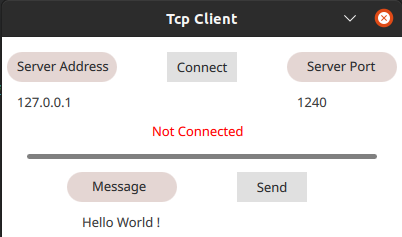

# Qt-TcpClient
Simple Tcp Client Application with Qt (C++ and Qml)

Functionalites:
* Tcp server connect, disconnect
* Send message to target Tcp server

Dependencies: 
* QTcpSocket Library

Note: 
* use test tool for application testing

